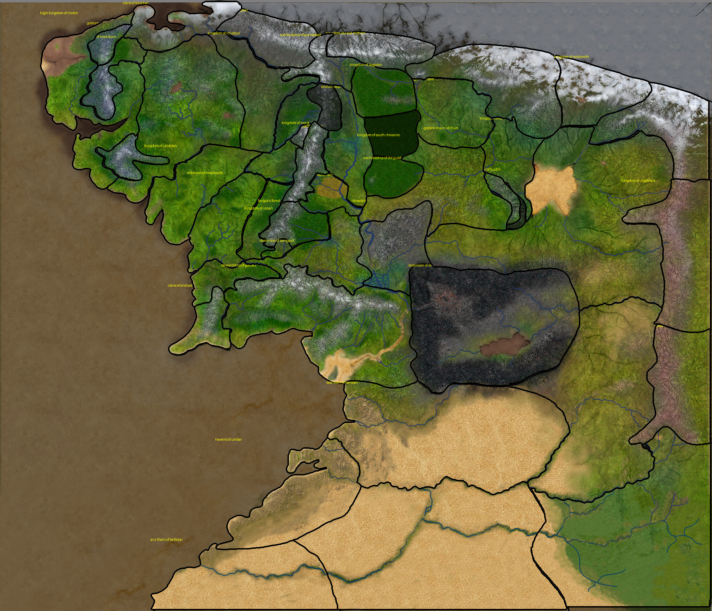

# TAOM — Tales From the Age of Men

A Lord of the Rings total conversion mod for **Mount & Blade II: Bannerlord v1.4.5**.



## What is it

TAOM reimagines Bannerlord as Middle-earth during the War of the Ring. More than twenty kingdoms wage
war across a custom map — hundreds of unique troops, rideable war beasts (war elephants, giant
spiders, wargs), race-specific lifespans, alignment-driven diplomacy, a full career/class progression
system, per-kingdom special resources, and dozens of other systems. Every kingdom, clan, lord, and
troop has been replaced or rewritten to fit Tolkien's world.

**By the numbers:** 55 feature modules · 38 GameModel overrides · 30+ Harmony patch categories ·
50 careers across 16 cultures · 11 special resources across 18 kingdoms · 800+ troop definitions ·
2,600+ unit tests · 85 feature docs.

> The active development branch (and the GitHub default) is **`bannerlord-1.4.5`**.

## Quick Start (Developers)

**Prerequisites**

- Mount & Blade II: Bannerlord **v1.4.5** installed
- Visual Studio 2022 (or the .NET SDK + MSBuild) — targets .NET Framework 4.7.2
- `BANNERLORD_GAME_DIR` environment variable pointing at your game install
  (the `setup-dev-env.ps1` script configures this)

**Build & test**

```powershell
git clone https://github.com/haterade22/TAOM      # lands on bannerlord-1.4.5
cd TAOM

.\setup-dev-env.ps1        # configure BANNERLORD_GAME_DIR + dependencies
.\build.ps1                # build the mod
.\build.ps1 -RunTests      # build + run the test suite
dotnet test TAOM.Tests     # tests only
```

A successful build deploys the module into your game's `Modules/` folder. Enable **TAOM** in the
Bannerlord launcher and start a **new campaign** (existing saves are not supported).

`TAOM.sln` at the root contains both `Main` (mod code) and `TAOM.Tests`. Tests run with MSTest +
NSubstitute. Shared build settings live in [`Directory.Build.props`](Directory.Build.props).

## Project Structure

```
TAOM/
├── Main/                     # Mod source (.NET Framework 4.7.2)
│   ├── Features/             # 55 feature modules (CareerSystem, SpecialResources, Elephant, …)
│   ├── Core/                 # Core infrastructure + IoC
│   ├── Adapters/             # Sealed-type adapters (IHeroAdapter, etc.)
│   └── _Module/              # Bannerlord module files (SubModule.xml, ModuleData, GUI)
├── TAOM.Tests/               # Unit tests (MSTest + NSubstitute, 2,600+ tests)
├── docs/
│   ├── adrs/                 # Architecture Decision Records (11)
│   ├── features/             # Feature documentation (85 files)
│   └── migration/            # Bannerlord version-migration tracking
├── tools/                    # Rebalancing + localization scripts
├── .claude/                  # Claude Code config (skills, agents, rules, hooks, memory)
├── .codex/                   # Codex adversarial-reviewer config
├── CLAUDE.md                 # AI instruction file (authoritative project reference)
├── AGENTS.md                 # Codex review instructions
└── build.ps1                 # Build script
```

## Architecture

All mod logic follows one pattern:

```
[HarmonyPatch / GameModel / CampaignBehavior] → IHookInterface → Service → IAdapter
```

Services never touch TaleWorlds sealed types directly — they work through adapter interfaces, which
keeps business logic fully unit-testable.

**Non-negotiable rules:**

- TDD mandatory (red → green → refactor)
- Entry points under 150 lines — delegate to services
- No `#region`, no `[Obsolete]`, no `#if DEBUG` (except IoC registration)
- Adapter pattern for any TaleWorlds sealed type
- Research TaleWorlds internals before implementing — never guess signatures

See the [Architecture Decision Records](docs/adrs/) for the full set of design constraints.

## Features

### Factions

| Free Peoples | Dark Powers | Independent |
|--------------|-------------|-------------|
| Gondor · Rohan · Erebor · Dale · Rivendell · Lothlórien · Mirkwood · **Lindon** | Mordor · Isengard · Dol Guldur · Gundabad · **Misty Mountain Orcs** · **Goblin-town** · **Blue Craig** · Dunland · Easterlings (Rhûn) · Harad · Khand | Umbar (corsairs) · Shaghâna · Âbanissa |

Over 100 clans and 800+ unique troop definitions across all factions. Settlements like Erebor are
hand-kitbashed in the editor — see the [build reference](docs/kitbash/erebor/).

### Headline systems

- **Career System** — 50 careers across 16 cultures; pick one at character creation, progress a
  tiered choice tree, unlock passive bonuses + an active battlefield ability (press **V**).
- **Legendary War Beasts** — ride wargs, Harad **war elephants** (trample + tusk auto-attacks), and
  Dol Guldur **giant spiders** (auto-bite); each driven by behavior-tree AI and fielded as cavalry.
- **Special Resources** — 11 per-kingdom resources (War Spoils, Gems, Elven Wine, …) that gate
  elite troop upgrades; XML-driven with many-to-one kingdom/culture mappings.
- **Cultural Feats** — lore-driven per-culture bonuses (Rohan cavalry speed, Erebor smithing, Mordor
  raid damage, Gondor loyalty, …), each backed by a dedicated GameModel override.
- **Culture Conversion** — conquered towns, castles, and their villages gradually adopt the
  conqueror's culture, switching recruitment pools to match.
- **Smart Battle AI** — coordinated cavalry line-charges, companion-led formation tactics, and mixed
  formations that interleave unit types instead of segregating them.
- **War of the Ring** — scripted phased escalation into permanent total war between Free Peoples and
  Dark Powers; configurable via JSON + MCM.
- **Race & Age System** — race-appropriate lifespans and fertility (immortal elves, 250-year
  dwarves, fast-breeding orcs, ageless Nazgûl).
- **Named Companions** — 18 lore companions (Aragorn, Legolas, Gimli, …) as recruitable wanderers.
- **Bandit Management** — five LOTR bandit cultures replace vanilla hideouts, with configurable
  density and themed encounter flavor.
- **Localization** — full text support across **12 languages** with graceful English fallback.

…and dozens more systems (castle recruitment, culture marketplace, troop-weight balancing,
messengers, quick-action inventory, banner color persistence, settlement guards, custom battles,
siege defense, tournament armor, shader precompilation, and more). Each is documented under
[`docs/features/`](docs/features/). LOTR rules are enforced through **38 GameModel overrides** and
**30+ Harmony patch categories** — both registries are catalogued in [CLAUDE.md](CLAUDE.md).

## How It's Built (AI-assisted pipeline)

TAOM is developed with a structured, AI-assisted engineering pipeline.

- **[Claude Code](https://docs.anthropic.com/en/docs/claude-code)** is integrated as more than a
  code generator: 41 custom slash-command skills, 5 specialized agents, 22 automated hooks,
  18 path-scoped rule files, persistent cross-session memory, and 7 MCP servers (symbolic code
  navigation, decompilation, git, GitHub). [CLAUDE.md](CLAUDE.md) is the authoritative reference
  every session loads.
- **Codex** (OpenAI) runs as an *independent adversarial reviewer* — it shares no session context
  with Claude, so it provides a genuine second opinion. 40+ reviews completed to date; review
  instructions live in [AGENTS.md](AGENTS.md).
- **Mandatory completion workflow** — every C# feature passes a 4-phase gate before merge:
  build + internal `/deep-review` → Codex adversarial review → self-review of the fixes →
  closeout (issue, feature doc, CHANGELOG).

## Installing to Play (non-developers)

TAOM ships as a set of modules. Required alongside the core `TAOM` module:

- Companion modules: **TAOM_Map**, **LOTRLOME_Armory**, **TAOM.Dependencies**, **Alliance.Wargs**
- BUTR dependencies: **Harmony** and **Mod Configuration Menu (MCM)**

Place all modules in your Bannerlord `Modules/` directory, enable them in the launcher, and start a
**new campaign** — existing saves are not supported.

## Contributing

1. Read [CLAUDE.md](CLAUDE.md) for coding standards and conventions
2. Write tests first — TDD is mandatory
3. Use the adapter pattern for any TaleWorlds sealed type
4. Keep Harmony patches and entry points thin (< 150 lines); delegate to services
5. Research TaleWorlds behavior before implementing — decompile, don't guess

## License

**Code** (C# mod source): [MIT License](LICENSE)

**Content** (art, lore, data, XML assets derived from Tolkien's works):
[CC BY-NC-SA 4.0](LICENSE-CONTENT.md) — non-commercial, attribution required, share-alike.

This mod is a fan project and is not affiliated with or endorsed by the Tolkien Estate,
New Line Cinema, or TaleWorlds Entertainment.

## Acknowledgments

- **[The Old Realms (TOR)](https://www.moddb.com/mods/the-old-realms)** — TAOM's Career System and
  Special Resources were inspired by TOR's Warhammer total conversion. Their career-progression and
  resource-gating designs served as the reference architecture, adapted for a Lord of the Rings
  setting.
