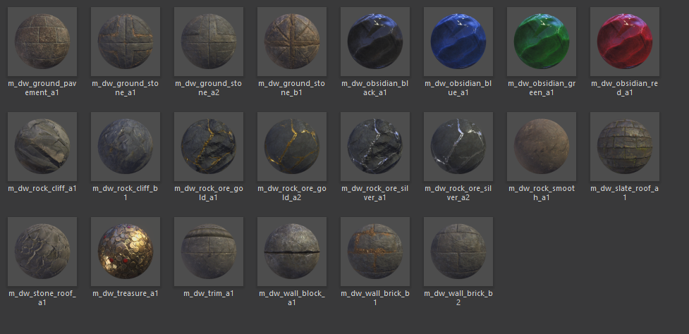

# Erebor materials (`m_dw_*`)

Materials bind textures + shader parameters. Meshes reference materials by
name, and the engine resolves the visual appearance through this chain:
`mesh → material → textures`.

## Ground materials

| Material | Binds texture | Use |
|---|---|---|
| `m_dw_ground_pavement_a1` | `t_dw_ground_pavement_a1_{d,n,s}` | Formal paved floor — dark stone with cross inlay |
| `m_dw_ground_stone_a1` | `t_dw_ground_stone_a1_{d,n,s}` | Primary A-family floor stone |
| `m_dw_ground_stone_a2` | `t_dw_ground_stone_a2_{d,n,s}` | A-family weathered variant |
| `m_dw_ground_stone_b1` | `t_dw_ground_stone_b1_{d,n,s}` | B-family rougher floor |

## Rock / cliff materials

| Material | Binds texture | Use |
|---|---|---|
| `m_dw_rock_cliff_a1` | `t_dw_rock_cliff_a1_{d,n,s}` | A-family natural cliff (reddish brown) |
| `m_dw_rock_cliff_b1` | `t_dw_rock_cliff_b1_{d,n,s}` | B-family natural cliff (grey/blue) |
| `m_dw_rock_smooth_a1` | `t_dw_rock_smooth_a1_{d,n,s}` | Smooth brown rock |

## Obsidian (colour-swap family — 4 materials, 1 texture set)

All four share `t_dw_rock_obsidian_a1_{n,s,h}`; they differ only in which
diffuse variant they bind (`_d`, `_d2`, `_d3`, `_d4`).

| Material | Binds diffuse | Use |
|---|---|---|
| `m_dw_obsidian_black_a1` | `t_dw_rock_obsidian_a1_d` | Polished black obsidian |
| `m_dw_obsidian_blue_a1` | `t_dw_rock_obsidian_a1_d2` | Sapphire-blue obsidian |
| `m_dw_obsidian_green_a1` | `t_dw_rock_obsidian_a1_d3` | Emerald-green obsidian |
| `m_dw_obsidian_red_a1` | `t_dw_rock_obsidian_a1_d4` | Ruby-red obsidian |

## Ore materials

| Material | Binds texture | Use |
|---|---|---|
| `m_dw_rock_ore_gold_a1` | `t_dw_rock_ore_gold_a1_*` | Gold vein, primary variant |
| `m_dw_rock_ore_gold_a2` | `t_dw_rock_ore_gold_a2_*` | Gold vein, alternate |
| `m_dw_rock_ore_silver_a1` | `t_dw_rock_ore_silver_a1_{d,h,n,s}` | Silver vein, primary |
| `m_dw_rock_ore_silver_a2` | `t_dw_rock_ore_silver_a2_{d,n}` | Silver vein, alternate |

## Roof materials

| Material | Binds texture | Use |
|---|---|---|
| `m_dw_slate_roof_a1` | `t_dw_slate_roof_a1_{d,n,s}` | Slate roof tiles |
| `m_dw_stone_roof_a1` | `t_dw_stone_roof_a1_{d,h,n,s}` | Cracked stone roof |

## Wall materials

| Material | Binds texture | Use |
|---|---|---|
| `m_dw_wall_block_a1` | `t_dw_wall_block_a1_{d,n,s}` | A-family wall blocks (primary dwarven stonework) |
| `m_dw_wall_brick_b1` | `t_dw_wall_brick_b1_{d,n,s}` | B-family weathered brick |
| `m_dw_wall_brick_b2` | `t_dw_wall_brick_b2_{d,n,s}` | B-family alternate brick |

## Trim material

| Material | Binds texture | Use |
|---|---|---|
| `m_dw_trim_a1` | `t_dw_trim_a1_{d,n,s}` | Ground-trim pieces, wall beams, column overlays |

## Special-purpose materials

| Material | Binds texture | Use |
|---|---|---|
| `m_dw_treasure_a1` | `t_dw_treasure_a1_{d,n,s}` | Gold pile decoration (Smaug's hoard) |

## How meshes bind to materials (inferred from names)

The mesh's letter/digit suffix maps to the material's letter/digit. In the
usual case:

| Mesh suffix | Likely material |
|---|---|
| `sm_dw_wall_3m_a` / `_win_a1` / `_door_a1` / `_corn_a` | `m_dw_wall_block_a1` (and its shape-variant siblings) |
| `sm_dw_wall_3m_b` / `_win_b1` etc. | `m_dw_wall_brick_b1` |
| `sm_dw_wall_3m_c` / `_win_c1` etc. | C-family material (not visible in the current browser page — likely exists) |
| `sm_dw_ground_3m_a1` | `m_dw_ground_stone_a1` or `m_dw_ground_pavement_a1` |
| `sm_dw_ground_3m_b1` | `m_dw_ground_stone_b1` |
| `sm_dw_roof_str_a1` / `_top_a1` / `_side_a1` | `m_dw_slate_roof_a1` |
| `sm_dw_roof_str_b1` | Potentially `m_dw_stone_roof_a1` or another roof variant — needs confirmation |
| `sm_dw_pile_gold_a1` | `m_dw_treasure_a1` |
| `sm_dw_castle_wall_a1_*` / `_tower_a1` | `m_dw_wall_block_a1` |

## Update rule

When a mesh turns out to reference a material different from the inference
above, correct the mapping here. If a new material arrives (e.g., a proper
C-family wall material, or new obsidian colours), add it to the relevant
section.

---

<!-- backlinks-start auto-generated; edit lint_docs.py / build_backlinks.py to change -->

## Referenced by

- [docs/kitbash/erebor/README.md](./README.md)

<!-- backlinks-end -->
