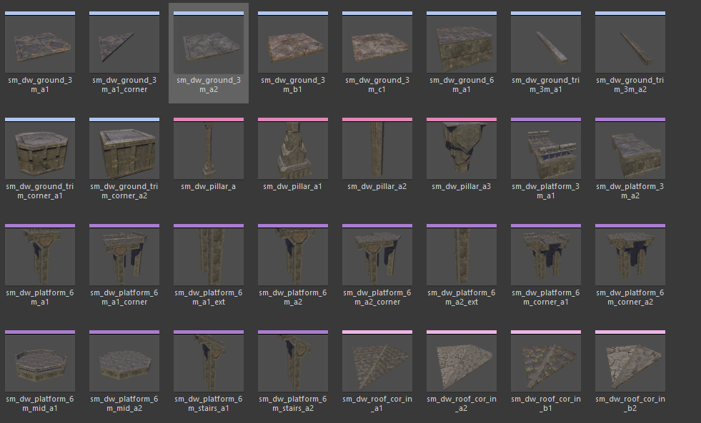
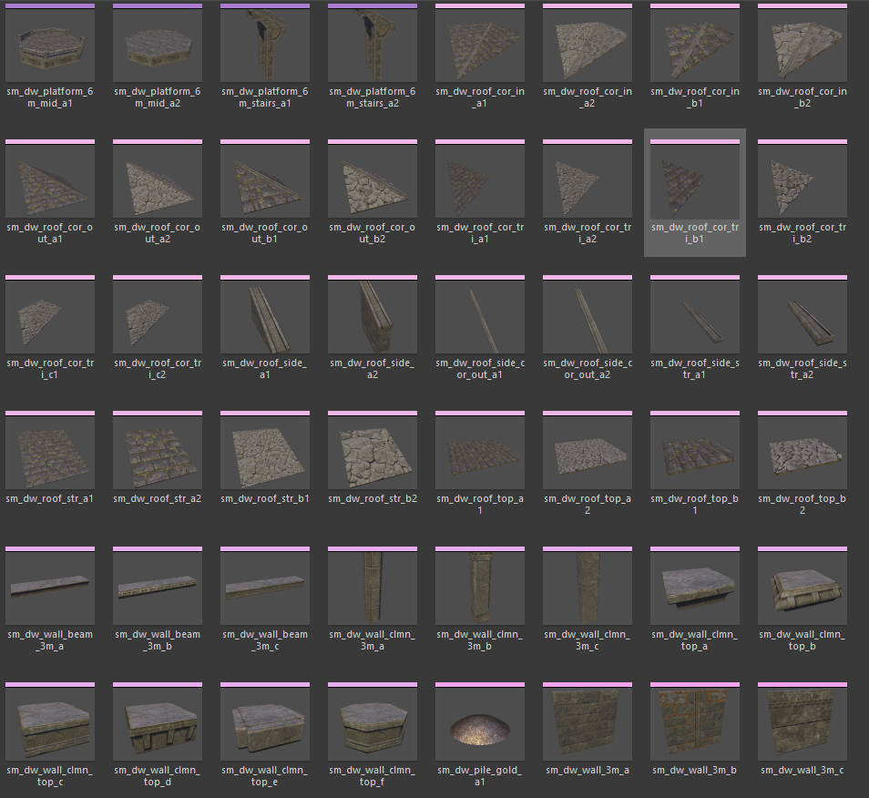
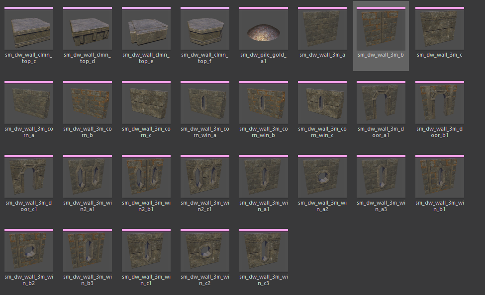
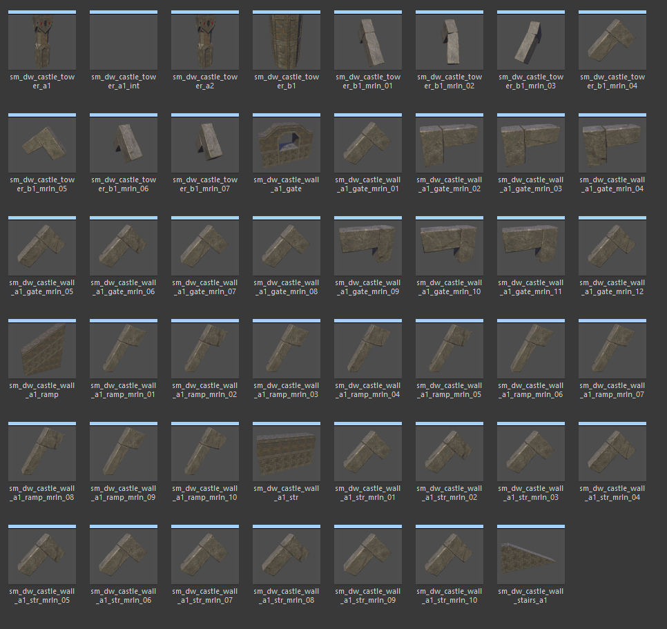
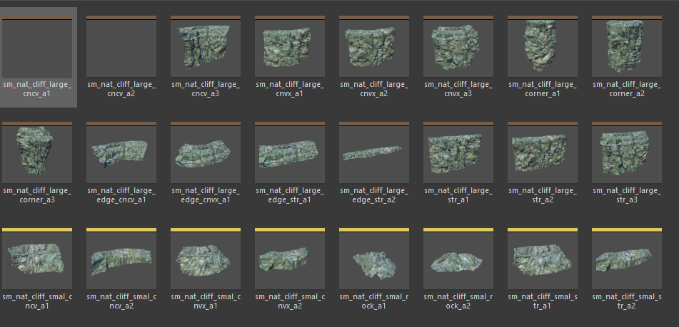
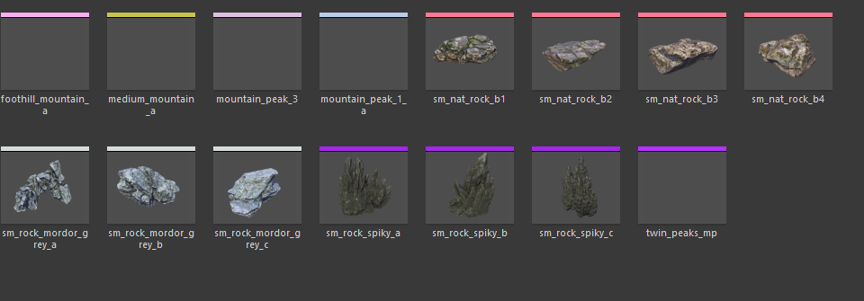

# Erebor meshes (`sm_dw_*`)

Every visual mesh in the erebor kit. Shapes, intended use, and family
membership. Each mesh `sm_dw_<name>` has a paired `bo_sm_dw_<name>`
collision body (with 16 known orphan exceptions — see the kitbash XML).

## Ground (floor tiles)

| Mesh | Shape | Notes |
|---|---|---|
| `sm_dw_ground_3m_a1` | 3m × 3m square | Primary A-family floor — paved with cross pattern |
| `sm_dw_ground_3m_a1_corner` | Diagonal corner | 45° cut corner for chamfered/angled floors |
| `sm_dw_ground_3m_a2` | 3m × 3m square | A-family weathered variant |
| `sm_dw_ground_3m_b1` | 3m × 3m square | B-family floor (rougher) |
| `sm_dw_ground_3m_c1` | 3m × 3m square | C-family floor |
| `sm_dw_ground_6m_a1` | 6m × 6m square | Larger single tile (A-family) |
| `sm_dw_ground_trim_3m_a1` | 3m raised edge strip | Perimeter border around a floor |
| `sm_dw_ground_trim_3m_a2` | 3m edge strip, A2 | Weathered variant |
| `sm_dw_ground_trim_corner_a1` | Trim corner (90°) | Corner where two edge strips meet |
| `sm_dw_ground_trim_corner_a2` | Trim corner, A2 | Weathered variant |

**Typical A-family floor composition:**
- Interior: `_3m_a1` tiles on a 3m grid
- Perimeter: `_trim_3m_a1` edge strips
- Corners of the trim: `_trim_corner_a1`

## Pillars

Four distinct SHAPES (not just textures). Pillar `_a` through `_a3` are all
A-family but represent different styles / heights.

| Mesh | Shape | Notes |
|---|---|---|
| `sm_dw_pillar_a` | Stout simple column, short | Plain support column |
| `sm_dw_pillar_a1` | Tall ornate, carved base | Decorative column with base/capital |
| `sm_dw_pillar_a2` | Taller, thin, weathered | Damaged/ancient look |
| `sm_dw_pillar_a3` | Narrowest variant | Slender column |

## Wall decoration (beams, columns, capitals)

Overlay pieces that attach to a plain wall face for a ribbed/framed look.
Not structural on their own.

| Mesh | Shape | Notes |
|---|---|---|
| `sm_dw_wall_beam_3m_a` | Horizontal beam, 3m, A | Lintel across a wall face |
| `sm_dw_wall_beam_3m_b` | Horizontal beam, 3m, B | B-family variant |
| `sm_dw_wall_beam_3m_c` | Horizontal beam, 3m, C | C-family variant |
| `sm_dw_wall_clmn_3m_a` | Vertical column, 3m, A | Slender rib on a wall face |
| `sm_dw_wall_clmn_3m_b` | Vertical column, 3m, B | B-family |
| `sm_dw_wall_clmn_3m_c` | Vertical column, 3m, C | C-family |
| `sm_dw_wall_clmn_top_a/b/c/d/e/f` | Column capitals | 6 capital styles — cap that sits on top of a column |

## Walls (3m modular core)

3m wide × 3m tall. The LETTER is the texture family (`_a` = wall blocks,
`_b` = brick, `_c` = tertiary). Digit (when present) is the shape variant.

### Plain walls
| Mesh | Shape | Notes |
|---|---|---|
| `sm_dw_wall_3m_a` | Plain flat wall | A-family, no features |
| `sm_dw_wall_3m_b` | Plain flat wall | B-family (brick) |
| `sm_dw_wall_3m_c` | Plain flat wall | C-family |

### Corner walls (USE AT CORNERS for clean joints)
| Mesh | Shape | Notes |
|---|---|---|
| `sm_dw_wall_3m_corn_a` | Wall with corner cleat | A-family — 90° join with adjacent corner wall |
| `sm_dw_wall_3m_corn_b` | Wall with corner cleat | B-family |
| `sm_dw_wall_3m_corn_c` | Wall with corner cleat | C-family |
| `sm_dw_wall_3m_corn_win_a` | Corner wall + arrow slit | A-family with small defensive window |
| `sm_dw_wall_3m_corn_win_b` | Corner wall + window | B-family |
| `sm_dw_wall_3m_corn_win_c` | Corner wall + window | C-family |

### Walls with doors
| Mesh | Shape | Notes |
|---|---|---|
| `sm_dw_wall_3m_door_a1` | Wall with doorway cut in | A-family |
| `sm_dw_wall_3m_door_b1` | Wall with doorway | B-family |
| `sm_dw_wall_3m_door_c1` | Wall with doorway | C-family |

### Walls with windows
Window SHAPES: `1` = round/arched small; `2` = elongated vertical slit;
`3` = arrow slit. Each shape exists in A, B, C textures.

| Mesh | Shape | Notes |
|---|---|---|
| `sm_dw_wall_3m_win_a1` | Round arched window | A-family |
| `sm_dw_wall_3m_win_a2` | Elongated vertical window | A-family |
| `sm_dw_wall_3m_win_a3` | Arrow slit | A-family |
| `sm_dw_wall_3m_win_b1/b2/b3` | Same 3 shapes | B-family |
| `sm_dw_wall_3m_win_c1/c2/c3` | Same 3 shapes | C-family |
| `sm_dw_wall_3m_win2_a1` | Wall with 2 stacked windows | A-family (2-storey effect) |
| `sm_dw_wall_3m_win2_b1` | Wall with 2 stacked windows | B-family |
| `sm_dw_wall_3m_win2_c1` | Wall with 2 stacked windows | C-family |

## Platforms (raised floors, 6m modular)

For multi-level structures. 6m base module, with corner/ext/mid/stairs.

| Mesh | Shape | Notes |
|---|---|---|
| `sm_dw_platform_3m_a1` | 3m raised platform slab | A-family small raised platform |
| `sm_dw_platform_3m_a2` | 3m raised platform slab | A-family weathered variant |
| `sm_dw_platform_6m_a1` | 6m raised platform slab | A-family primary |
| `sm_dw_platform_6m_a1_corner` | L-shape corner piece | Outside corner of A1 platform |
| `sm_dw_platform_6m_a1_ext` | Extension piece | Extend a platform outward |
| `sm_dw_platform_6m_a2` | 6m platform, A2 variant | Alternate texture |
| `sm_dw_platform_6m_a2_corner` | L-shape corner, A2 | |
| `sm_dw_platform_6m_a2_ext` | Extension, A2 | |
| `sm_dw_platform_6m_corner_a1` | Distinct corner shape | Different from `_a1_corner` — alternate corner style |
| `sm_dw_platform_6m_corner_a2` | Alternate corner, A2 | |
| `sm_dw_platform_6m_mid_a1` | Middle support piece | Underside support for long platforms, A1 |
| `sm_dw_platform_6m_mid_a2` | Middle support, A2 | |
| `sm_dw_platform_6m_stairs_a1` | Stairs up to platform | A1 access stairs |
| `sm_dw_platform_6m_stairs_a2` | Stairs up to platform | A2 access stairs |

Note the two distinct corner conventions:
- `_a1_corner` — the A1-textured corner variant of the standard platform
- `_corner_a1` — a different mesh shape labeled "corner" in A1 texture

## Roof (pitched system)

Modular pitched roof. Panels + ridges + side edges + inside/outside corners.

### Pitched panels (the sloped roof faces)
| Mesh | Shape | Notes |
|---|---|---|
| `sm_dw_roof_str_a1` | Straight pitched panel | A1, slate texture (primary) |
| `sm_dw_roof_str_a2` | Straight pitched panel | A2 variant |
| `sm_dw_roof_str_b1` | Straight pitched panel | B-family (weathered) |
| `sm_dw_roof_str_b2` | Straight pitched panel | B2 variant |

### Ridge caps (apex of the roof)
| Mesh | Shape | Notes |
|---|---|---|
| `sm_dw_roof_top_a1` | Ridge cap — long thin strip along apex | A1 — seals where two pitched panels meet at the top |
| `sm_dw_roof_top_a2` | Ridge cap | A2 variant |
| `sm_dw_roof_top_b1` | Ridge cap | B-family |
| `sm_dw_roof_top_b2` | Ridge cap | B2 variant |

### Side / eave pieces (gable edges)
| Mesh | Shape | Notes |
|---|---|---|
| `sm_dw_roof_side_a1` | Side/eave piece | A1 (bargeboard-like trim at the roof edge) |
| `sm_dw_roof_side_a2` | Side/eave piece | A2 variant |
| `sm_dw_roof_side_str_a1` | Straight side edge | A1 long straight run of the eave |
| `sm_dw_roof_side_str_a2` | Straight side edge | A2 variant |
| `sm_dw_roof_side_cor_out_a1` | Side outside corner | A1 — where two side/eave pieces meet at an outer corner |
| `sm_dw_roof_side_cor_out_a2` | Side outside corner | A2 variant |

### Corner pieces (hip / valley)
| Mesh | Shape | Notes |
|---|---|---|
| `sm_dw_roof_cor_out_a1/a2/b1/b2` | Outside corner panel | Hip roof outside corner (wraps a hip) |
| `sm_dw_roof_cor_tri_a1/a2/b1/b2/c1/c2` | Triangular corner | Hip/valley triangular fill pieces (3 texture families, 6 variants) |
| `sm_dw_roof_cor_in_a1/a2/b1/b2` | Inside corner | Valley fold (two roofs meeting inward) |

## Castle walls (defensive fortifications)

Larger-scale fortification wall system. All currently A1 texture (only one
texture family exists for these).

### Tower
| Mesh | Shape | Notes |
|---|---|---|
| `sm_dw_castle_tower_a1` | Tall tower with crenellations on top | Full cylindrical tower |
| `sm_dw_castle_tower_a1_int` | Tower interior | Hollow inside view (for cutaway / interior visible scenes) |
| `sm_dw_castle_tower_a2` | Tower variant | Alternate tower design |
| `sm_dw_castle_tower_b1` | Base body of tower | Bottom section without the top |
| `sm_dw_castle_tower_b1_mrln_01..07` | Tower merlons (crenellation teeth) | 7 variants — sit ON TOP of a tower to create battlements |

### Straight wall
| Mesh | Shape | Notes |
|---|---|---|
| `sm_dw_castle_wall_a1_str` | Straight wall segment | Main castle wall piece |
| `sm_dw_castle_wall_a1_str_mrln_01..10` | Wall-top merlons | 10 variants — cap the straight wall for a crenellated look |

### Gate
| Mesh | Shape | Notes |
|---|---|---|
| `sm_dw_castle_wall_a1_gate` | Gate section | Wall with arch / gate opening |
| `sm_dw_castle_wall_a1_gate_mrln_01..12` | Gate-top merlons | 12 variants |

### Ramp
| Mesh | Shape | Notes |
|---|---|---|
| `sm_dw_castle_wall_a1_ramp` | Sloped wall / rampart | Wall that ramps up (for battlement access or sloped terrain) |
| `sm_dw_castle_wall_a1_ramp_mrln_01..10` | Ramp-top merlons | 10 variants — cap the ramp with merlons |

### Stairs
| Mesh | Shape | Notes |
|---|---|---|
| `sm_dw_castle_wall_stairs_a1` | Stairs up to battlement walkway | Interior access stair |

## Decorations

| Mesh | Shape | Notes |
|---|---|---|
| `sm_dw_pile_gold_a1` | Pile of gold | Treasure heap — Smaug's hoard / treasury decoration. No collision required for most uses. |

## Nature (shared, added to kitbash for mountainside carving)

| Mesh family | Members | Notes |
|---|---|---|
| `sm_nat_cliff_large_cncv_a1/a2/a3` | Concave large cliff faces | A-family three variants |
| `sm_nat_cliff_large_cnvx_a1/a2/a3` | Convex large cliff faces | A-family three variants |
| `sm_nat_cliff_large_corner_a1/a2/a3` | Corner large cliffs | A-family three variants |
| `sm_nat_cliff_large_edge_cncv_a1` | Concave edge large cliff | A1 |
| `sm_nat_cliff_large_edge_cnvx_a1` | Convex edge large cliff | A1 |
| `sm_nat_cliff_large_edge_str_a1/a2` | Straight edge large cliffs | A1/A2 |
| `sm_nat_cliff_large_str_a1/a2/a3` | Straight large cliffs | A-family three variants |
| `sm_nat_cliff_smal_cncv_a1/a2` | Concave small cliffs | A-family |
| `sm_nat_cliff_smal_cnvx_a1/a2` | Convex small cliffs | A-family |
| `sm_nat_cliff_smal_rock_a1/a2` | Small rock pieces | A-family |
| `sm_nat_cliff_smal_str_a1/a2` | Straight small cliffs | A-family |

Not included in the erebor kitbash (already referenced elsewhere):
- `sm_nat_rock_b1/b2/b3/b4` (used in `lotraom_prefabs_nature.xml`)
