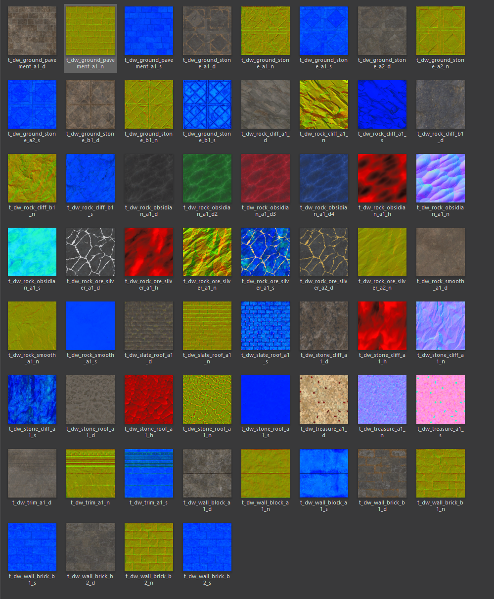

# Erebor raw textures (`t_dw_*`)

Source data — the actual texture maps that materials reference. Most entries
come in three channels (`_d` diffuse, `_n` normal, `_s` specular); some also
have height (`_h`) or alternate diffuse variants (`_d2`, `_d3`, `_d4`).

## Channel legend

| Suffix | Purpose |
|---|---|
| `_d` | Diffuse (base colour) |
| `_d2` / `_d3` / `_d4` | Alternate diffuse — swap colour while sharing the same normal and spec (e.g., obsidian black/blue/green/red) |
| `_n` | Normal map (surface detail) |
| `_s` | Specular map (reflectivity) |
| `_h` | Height map (parallax / displacement) |

## Ground textures

| Texture base | Channels | Description |
|---|---|---|
| `t_dw_ground_pavement_a1` | `_d`, `_n`, `_s` | Dark paved stone with cross-pattern inlay (formal dwarven floor) |
| `t_dw_ground_stone_a1` | `_d`, `_n`, `_s` | Plain grey floor stone |
| `t_dw_ground_stone_a2` | `_d`, `_n`, `_s` | A-family weathered floor stone variant |
| `t_dw_ground_stone_b1` | `_d`, `_n`, `_s` | B-family rougher floor stone |

## Rock / cliff textures

| Texture base | Channels | Description |
|---|---|---|
| `t_dw_rock_cliff_a1` | `_d`, `_n`, `_s` | Natural rocky cliff face (A-family — reddish brown) |
| `t_dw_rock_cliff_b1` | `_d`, `_n`, `_s` | Natural cliff (B-family — greyer/bluer) |
| `t_dw_rock_smooth_a1` | `_d`, `_n`, `_s` | Smooth brown rock |
| `t_dw_stone_cliff_a1` | `_d`, `_h`, `_n`, `_s` | Carved stone cliff face |

## Obsidian — colour-swap family (shared normal/spec, 4 diffuses)

One set of normal/spec/height; four diffuse variants for the four obsidian
colours. Materials (`m_dw_obsidian_black/blue/green/red_a1`) all bind the
same normal + spec + height and differ only in which diffuse channel they use.

| Texture | Purpose |
|---|---|
| `t_dw_rock_obsidian_a1_d` | Black obsidian diffuse |
| `t_dw_rock_obsidian_a1_d2` | Blue obsidian diffuse |
| `t_dw_rock_obsidian_a1_d3` | Green obsidian diffuse |
| `t_dw_rock_obsidian_a1_d4` | Red obsidian diffuse |
| `t_dw_rock_obsidian_a1_h` | Shared height map |
| `t_dw_rock_obsidian_a1_n` | Shared normal map |
| `t_dw_rock_obsidian_a1_s` | Shared specular map |

## Ore textures

| Texture base | Channels | Description |
|---|---|---|
| `t_dw_rock_ore_silver_a1` | `_d`, `_h`, `_n`, `_s` | Silver vein in rock (A1 variant) |
| `t_dw_rock_ore_silver_a2` | `_d`, `_n` | Silver vein, A2 variant |
| `t_dw_rock_ore_gold_a1` *(referenced by material; texture not visible in this screenshot batch)* | — | Gold vein — presumably same channel set as silver |
| `t_dw_rock_ore_gold_a2` *(referenced by material)* | — | Gold vein A2 variant |

## Roof textures

| Texture base | Channels | Description |
|---|---|---|
| `t_dw_slate_roof_a1` | `_d`, `_n`, `_s` | Horizontal slate tiles |
| `t_dw_stone_roof_a1` | `_d`, `_h`, `_n`, `_s` | Cracked stone roof |

## Wall textures

| Texture base | Channels | Description |
|---|---|---|
| `t_dw_wall_block_a1` | `_d`, `_n`, `_s` | A-family grey wall blocks |
| `t_dw_wall_brick_b1` | `_d`, `_n`, `_s` | B-family weathered brick |
| `t_dw_wall_brick_b2` | `_d`, `_n`, `_s` | B-family alternate weathered brick |

## Trim texture

| Texture base | Channels | Description |
|---|---|---|
| `t_dw_trim_a1` | `_d`, `_n`, `_s` | Plain grey stone trim (for ground-trim and wall-beam overlays) |

## Special-purpose textures

| Texture base | Channels | Description |
|---|---|---|
| `t_dw_treasure_a1` | `_d`, `_n`, `_s` | Golden treasure pile texture |

## Update rule

When new textures arrive (C-family walls, additional obsidian colours,
etc.), add them to the appropriate section above. When a texture's purpose
or channel set is clarified during a build session, amend the description.
