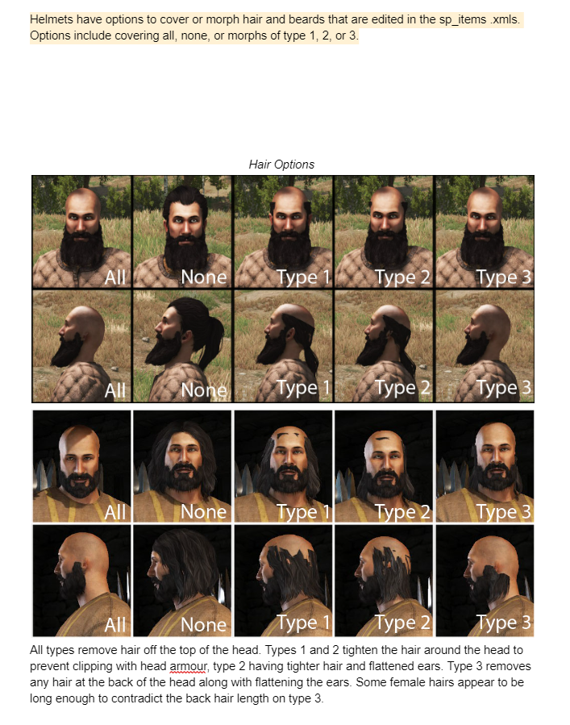
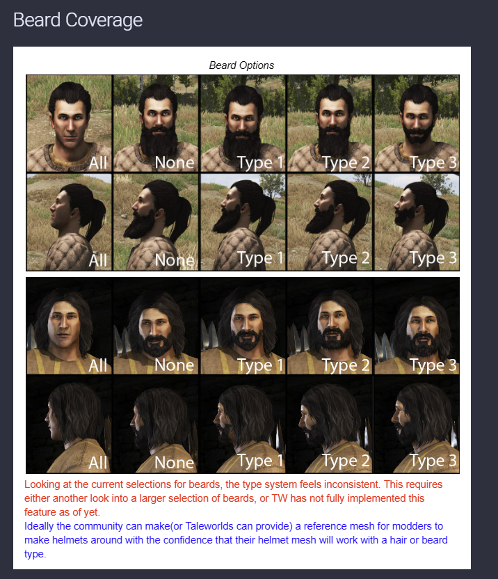

# Helmet hair and beard cover types

What `hair_cover_type` and `beard_cover_type` on a helmet's `<Armor>` element do to the wearer's hair and
beard, with pictures. Use it when auditing helmets in game or picking a value for a new one.

**Source:** the "Hair Options" and "Beard Coverage" figures on the bannerlordmodding.lt Items page,
<https://docs.bannerlordmodding.lt/modding/items/>, saved here 2026-10-05 because the page carries them only as
images. The engine facts below are TAOM's own, from the decompile and `Native/ModuleData/skins.xml`.

## Where the attribute goes

```xml
<Item id="..." Type="HeadArmor" ...>
  <ItemComponent>
    <Armor head_armor="24" hair_cover_type="type2" beard_cover_type="type1" ... />
  </ItemComponent>
</Item>
```

- **Values:** `None`, `Type1`, `Type2`, `Type3`, `Type4`, `All`. Parsed with `ignoreCase`, so `type2` and `all`
  are fine (`ArmorComponent.cs:190-191`). The default when absent is `None`.
- **Only the Head slot decides** (`Equipment.cs:101`). The same attribute on body armour or a cape does nothing to
  hair.
- **Item XML loads only at launch.** Restart the game after every edit; reloading a save is not enough.

## Hair



| Value | Effect (from the figure) |
|---|---|
| `All` | All hair hidden; the beard is untouched |
| `None` | Hair shown in full; use only on open headgear (hoods that show hair, circlets) |
| `Type1` | Hair removed from the top of the head, the rest pulled tight around the head so it clears a helmet shell |
| `Type2` | As Type1 but tighter, and the ears are flattened |
| `Type3` | Top and back hair removed, ears flattened; only the sides remain. Some long female hair still shows at the back |
| `Type4` | Not shown in the figure. Vanilla `skins.xml` maps it for hair (245 entries, several to `hair_*_type4` meshes), so it does something; look before using it |

All four Types remove the top of the head. Pick by how much of the back and sides the helmet's mesh covers:
a skullcap or open-faced helm suits Type1 or Type2, a helm with a neck guard Type3, a full great-helm `All`.

## Beard



| Value | Effect |
|---|---|
| `All` | Beard hidden entirely |
| `None` | Beard shown in full |
| `Type1` to `Type4` | A shorter mesh for **some** beards only. In vanilla `skins.xml`, `cover_type1` swaps 4 of the 41 human male beards and the other 37 show in full ([beard ledger](lotrlome-beard-cover-changes.md)) |

The source page itself calls the beard types inconsistent, and the figure agrees: Type1 to Type3 trim one beard
and barely touch another. Treat any Type as "beard mostly shows" and judge clipping per helmet in game.

**Races:** the Armory's dwarf and Saruman races map every cover type to the full beard, so for a dwarf helmet the
only real choices are `All` (hidden) and anything else (shown).

## Current Armory distribution

Measured 2026-10-05 over every `LOTRLOME_items/*/head_armors.xml` in the live Armory
(`grep -rhoi '<attr>="[^"]*"' --include=head_armors.xml . | tr A-Z a-z | sort | uniq -c`):

| Attribute | `all` | `none` | `type1` | `type2` | `type3` |
|---|---|---|---|---|---|
| `hair_cover_type` | 892 | 4 | 8 | 127 | 0 |
| `beard_cover_type` | 526 | 157 | 247 | 2 | 99 |

No helmet uses `type4` for either.

## Changing one

The helmets live in the unversioned `LOTRLOME_Armory`, so a reinstall or sync reverts an edit silently and no
validator reads these two attributes. Follow the pattern in [lotrlome-beard-cover-changes.md](lotrlome-beard-cover-changes.md):
back up each `head_armors.xml` outside the module, edit only the attribute (keep the file's CRLF or LF, no BOM),
diff against the backup, run `python tools/validate_moduledata.py`, and record every id, old and new value in
that ledger. Generators that write cover types (for example `generate_mordor_armor.py`, which emits `all` for
both) put the old value back for any id they regenerate.

## See also

- [items-armor.md](../modding/items-armor.md): the full `<Armor>` attribute table, including `covers_head`,
  which hides the face, not the hair.
