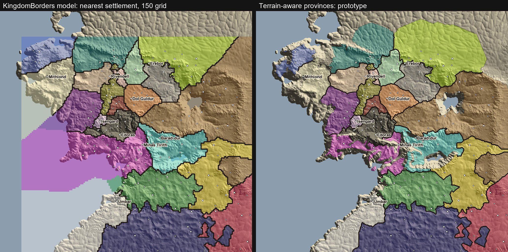
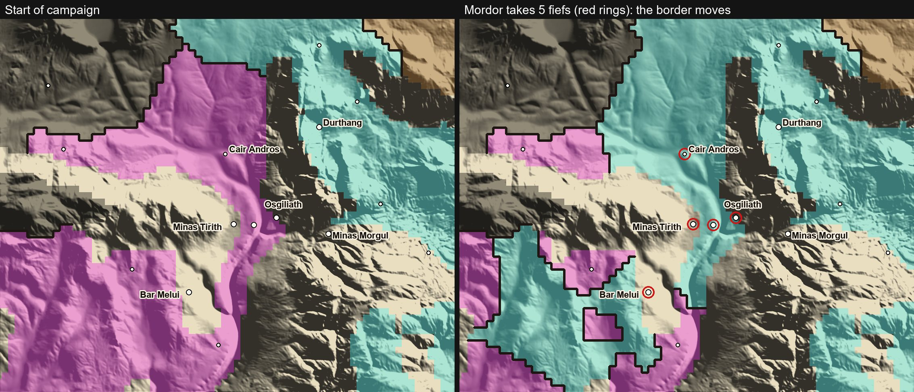
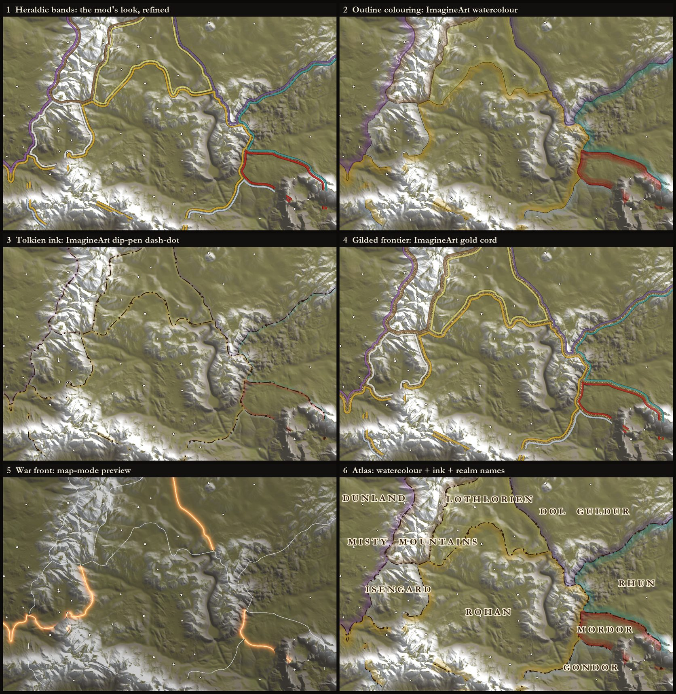

# Adoption Review: Kingdom Borders

**Date:** 2026-09-30 · **Procedure:** [`docs/ai-includes/external-repo-adoption.md`](../ai-includes/external-repo-adoption.md) · **Issue:** none yet (opened on approval)

| Source | License | Outcome |
|---|---|---|
| Kingdom Borders v1.2.2 (Nexus mod 10699, built for Bannerlord 1.4.7): one C# DLL plus MCM settings | Not readable: the Nexus page returned HTTP 403. Treated as all rights reserved, so ideas only and no code copied | **Approved:** all six proposals below, 2026-09-30. Not yet built; the issue and implementation wait on Mike's word |

Mike asked for a review of the mod and for better ideas for bringing it into TAOM. He likes what it does to
the map. The concept is worth having; the way it decides territory, and its colours, do not survive TAOM's
map. The proposals keep the look and replace the model underneath it.

## What it is

A campaign behavior that paints each kingdom's border on the campaign map as a coloured strip, one strip
on each side of the line in each realm's colour, fading in as the camera rises. It rebuilds the affected
part of the map when a fief changes hands or a clan changes kingdom. Settings (MCM v5): fade start 30 and
full opacity 300 (camera height), border width 1.05, gap 0.30, height offset 0.55, corner smoothing 3,
grid resolution 150, show on water off, toggle key `M`.

## Security pass

- Decompiled with `ilspycmd` 10.0.1: 14 types in namespace `KingdomBorders`, plus BUTR's embedded
  `Harmony.Extensions` source package.
- The mod's own types make no network, process, registry or reflection-emit calls. The `harmony.Patch`
  and `DynamicMethodDefinition` hits sit inside the bundled BUTR helper, which no `KingdomBorders` type
  references. It installs no Harmony patches.
- File I/O is its own debug log, `Documents\Mount and Blade II Bannerlord\Configs\KingdomBorders.log`,
  written only when the logging setting is on.
- It ships a cheat console command, `kb.change_owner_of_settlement_by_gift`, next to
  `kb.force_rebuild_borders`.
- **Verdict:** safe to learn from, and safe to run. TAOM ships none of it.

## How it works (decompiled)

1. **Territory.** Every town, castle and village (villages take their bound fief's kingdom) is a point.
   A 150 × 150 grid spans the points' bounding box plus 30 units; each cell takes the kingdom of the
   nearest point, unweighted and straight-line. Every connected patch of a kingdom except its largest is
   repainted as the surrounding kingdom and drawn later as a closed loop (the exclave fix).
2. **Lines.** Grid cell edges between two different kingdoms are chained into polylines per kingdom
   pair, smoothed with Chaikin's algorithm, trimmed at three-realm junctions, and offset to both sides
   (±gap/2 inner, ±(gap/2 + width) outer). Junctions get quadratic Bézier joins. Edges with no kingdom on
   one side are never drawn.
3. **Rendering.** Each strip becomes its own `Mesh.CreateMesh` and its own `GameEntity.CreateEmpty` in
   the map scene: four triangles per quad (both faces), vertex colour `Kingdom.PrimaryBannerColor`,
   heights from `IMapScene.GetHeightAtPoint` at each polyline vertex plus 0.55. The material is a copy
   of `vertex_color_mat` with `NoModifyDepthBuffer` (0x8) always, plus `NoDepthTest` (0x2) when water is
   hidden (the default) or `AlwaysDepthTest` (0x20000000) when shown. Quads whose four corners sit on
   water navmesh faces are skipped.
4. **Per frame.** `SubModule.OnApplicationTick` calls `UpdateAlphaForCameraDistance`, which calls
   `GameEntity.SetAlpha` on every border entity every frame (0 below 30, ramping to 0.7 at 300, using
   `Scene.LastFinalRenderCameraPosition.z`). The same tick polls `Input.IsKeyPressed` for the toggle,
   in any screen.
5. **Updates.** `OnSettlementOwnerChangedEvent` and `OnClanChangedKingdomEvent` queue a partial rebuild:
   grid cells in a box around the changed fiefs, then the affected kingdoms and their neighbours, then an
   AABB cull that keeps untouched strips. All phases are time-sliced (25 grid rows, 15 segments,
   40 removals and 600 flushed points per tick). The event filters are right: it skips
   `ByLeaveFaction` and `LeaveKingdom`, and v1.5.3 `ChangeKingdomAction` hands a leaving clan's fiefs to
   the kingdom's leader, so no border moves.

## Measured against TAOM

| Check | Result | Evidence |
|---|---|---|
| Map size | Settlements span 1,423 × 1,331 units; Calradia's span 683 × 506 | `settlements.xml` in live `TAOM_Map` and `SandBox` |
| Grid precision at the default 150 | 9.95 × 9.34 units per cell on TAOM, 4.98 on Calradia | same extents |
| Settlements feeding the grid | 78 towns, 143 castles, 622 villages; 22 kingdoms hold fiefs at start | live `settlements.xml` plus clan to kingdom via `spclans.xslt` and `clans.xml` |
| Border colour source | 9 of 22 realms have L* below 25 (near black); 15 pairs fall under ΔE76 15; Gundabad against Misty Mountain Orcs is ΔE 0.5, Abanissa against Dale 3.5 | `taom_spkingdoms.xml` and `spkingdoms.xslt` primary banner colours |
| Territory shape | Borders run straight through the Misty Mountains and the Mordor ranges; realms claim the Bay of Belfalas and every wild land up to the bounding box | left panel of the image below |
| Entity count | About 58 border segments and 34 junctions at campaign start: roughly 116 strip entities plus about 100 junction joins, each touched every frame | replica of its chaining on the starting ownership (estimate: water culling and exclaves ignored) |

**Left:** the mod's model on TAOM's starting ownership. **Right:** a heightmap-driven prototype of
proposal 1. Sea and lakes are never claimed; coherent steep ranges are walls; slopes cost more; towns
start with a head start of 30, castles 18, villages 6; land beyond claim cost 190 stays wild (24% of land
at these settings). Heightmap costs are a stand-in: in game the cost grid comes from navmesh terrain types,
which also turn rivers into borders and fords into crossings. Colours are a demo palette, not a proposal.
Terrain: `TAOM_Map/AssetSources/Support/terrain_heightmap.png` (8193² 16-bit) over the 1,600-unit
terrain (`node_dimension` 16 × `node_size` 100), heights 41.16 to 99.93.

## What it gets right

- The two-strip look: each realm's colour on its own side, with a gap, reads well at strategic zoom.
- The fade by camera height keeps close-up play clean.
- Nothing hitches: every rebuild is sliced across frames.
- Its event filtering matches the engine.

## Proposals

Each is decided separately, in order. Items 1 to 3 make a first release; 4 to 6 build on it.

| # | Proposal | Decision |
|---|---|---|
| 1 | Fixed terrain-aware provinces, live borders | **Approved** by Mike, 2026-09-30 |
| 2 | Curated realm palette | **Approved** by Mike, 2026-09-30 (a first lore-leaning palette to be drafted for his adjustment) |
| 3 | The same look, batched and draped | **Approved** by Mike, 2026-09-30, with the Atlas look as default (see the look exploration) |
| 4 | Map modes: political, Free Peoples against the Shadow, war relative to the player | **Approved** by Mike, 2026-09-30, for the second release |
| 5 | Atlas layer: realm names, optional painted wash, ImagineArt art | **Approved** by Mike, 2026-09-30: names now with a font fallback; the wash as a spike first |
| 6 | Border-crossing notices | **Approved** by Mike, 2026-09-30: one generic template; its translation runs on his word |

### 1. Fixed terrain-aware provinces, live borders

The borders move with the kingdoms: every capture, defection, grant or rebellion redraws them. What is
fixed is only which land goes with which fief, because towns, castles and villages never move. The mod
works the same way underneath (a cell's nearest settlement never changes, only its owner), but it
recomputes that answer on every change.

In the prototype the province map took 0.8 s to compute once; each ownership state then took about 1 ms
to relabel, moving 804 cells (about 7,850 sq units) to Mordor. The Gondor fief left inside the new
Mordor land gets its ring with no special case. The stepped edges are the prototype's 3.125-unit grid; in
game the lines are smoothed polylines.

**What.** Partition the land once per map into one province per fief (a town or castle with its
villages) by a multi-source cost-distance flood fill over a grid sampled from the campaign navmesh
(`IMapScene.GetFaceIndex` then `GetFaceTerrainType`). `Mountain`, `Cliff`, `Canyon` and
`LandRestriction` are walls; `River` and `NonNavigableRiver` add a crossing cost, so borders settle on
rivers; `Fording` and `Bridge` are cheap crossings; `Lake`, `Water`, `CoastalSea` and `OpenSea` are never
claimed. Towns get a larger head start than castles, castles than villages, and land beyond a maximum
claim cost stays wild. Cache the result keyed by the map and the settlement positions. At runtime a
border is any province edge whose two owners belong to different kingdoms, so an ownership change
re-selects precomputed boundary polylines instead of rebuilding a grid.

**Why.** Borders follow the Anduin, the Isen and the mountain walls, as on Tolkien's maps. It also deletes
most of the mod's machinery: the partial grid rebuild, the AABB cull, the exclave repair and the
preserved-strip keys exist only because it recomputes territory on every change. An isolated fief is
simply ringed; no exclave code is needed.

**Pros.** Lore-true lines; tiny per-change cost; a pure, testable domain; an O(1) "whose land is this"
lookup for later features.

**Cons.** A one-time sample at first load (262,144 face lookups at 512 × 512; cost not measured, cached
afterwards). Head starts, river cost and claim radius need one in-game tuning pass. A fief's land never
splits between two realms, which matches how Bannerlord transfers land.

**Recommendation.** Approve: this is what makes the feature better rather than a copy.

### 2. Curated realm palette

**What.** A data file maps each kingdom id to a map colour chosen for contrast against the terrain and its
neighbours, separate from banner colours. A kingdom created in play (rebels, the player's) takes the unused
palette entry farthest in ΔE from its neighbours. A unit test fails when any two curated colours fall
under a ΔE floor.

**Why.** Banner colours are the mod's only source, and in TAOM they collide (see the table above).

**Pros.** Every realm readable; one file to adjust; a test guards it.

**Cons.** One more entry to add when a kingdom is added (the test catches a forgotten or clashing one).

**Recommendation.** Approve.

### 3. The same look, batched and draped

**What.** Keep the two-strip look, rendered as one mesh per map tile (the vertex colour carries the realm,
so one mesh serves every realm in the tile), rebuilding only tiles whose borders changed. Drape vertices
from a height grid cached with the terrain sample, sampled densely enough to follow ridges, with no native
calls during a rebuild. Drive the fade from `MapCameraView.CameraDistance` and touch alpha only when its
quantized value changes. Ticks come from a `MapView` added with `MapScreen.AddMapView<T>()`, like
`FieldCampMapView`, so nothing runs off the map screen. Depth behaviour is decided in an in-game spike:
the mod's `NoDepthTest` never clips, but it draws through ridges and over map models.

**Why.** Same look, a fraction of the entities, and no per-frame work while the camera is still.

**Pros.** The look Mike likes; cheap; an optional tileable ink-stroke texture (an ImagineArt candidate)
drops onto the same strips with UVs measured in world length, so the pattern never stretches.

**Cons.** Three-realm junction joins need care; the mod's quadratic joins are the reference behaviour, to
be rewritten rather than copied.

**Recommendation.** Approve, with the depth choice taken from the spike.

#### Look exploration

Each look uses only what the strip mesh can supply: UVs across and along the line, the realm colour on
each side and one texture. They are drawn over a render of TAOM_Map's heightmap, using the approved
province model and starting ownership. Borders are simplified (Ramer-Douglas-Peucker) and then smoothed
(Chaikin), so the grid's steps disappear, as they would in game.

Three textures came from ImagineArt (`nano-banana-pro`, 1K, 45 credits each, 135 in total), each cut
into a seamless tile:
- a dip-pen dash-dot ink line;
- a twisted gold cord;
- a watercolour band with a pooled edge.

The originals, their prompts and the derived tiles are in
[`tools/realm_border_art/`](../../tools/realm_border_art/provenance.json), and the generations also
remain in the ImagineArt library.

**Caveats.**
- The backdrop is not the game's terrain.
- Widths are in screen pixels, so the game needs zoom-banded strip widths.
- Pale realm colours fade in watercolour, which proposal 2's palette has to allow for.
- Game textures would be regenerated at 2K as power-of-two tiles.

The war-front look belongs to proposal 4 and the lettered names to proposal 5.

**Decision (Mike, 2026-09-30): approved.**
- The Atlas look (6), watercolour outline colouring plus the dip-pen dash-dot, is the default.
- The player's own realm takes the gold cord, so its frontier is found at a glance.
- Heraldic bands (1) stay as a settings option.

### 4. Map modes

**What.** The border selector takes a grouping key per province. **Political:** kingdom.
**Free Peoples against the Shadow:** `IAlignmentService.ResolveSide`, which draws a single front line.
**War:** relative to the player, coloured with `NameplateRelationPalette` so the map and the nameplates
agree. One rebindable key cycles modes.

**Why.** The War of the Ring is TAOM's campaign arc (`WarOfTheRingMomentum`); a live front line is a
view no generic border mod can give.

**Pros.** Cheap once 1 and 3 exist; reuses existing services.

**Cons.** More controls to explain; a player-founded kingdom's side comes from `ResolveSide`'s culture
fallback.

**Recommendation.** Approve for the second release.

### 5. Atlas layer ("better 2D")

**What.** Realm names lettered across their land in TAOM's own `aniron` or `ringbearer` font, as a
Gauntlet overlay that fades in at strategic zoom, anchored at the point deepest inside each realm's largest
region. Optionally a parchment wash: rasterize realm tint and inked, dashed borders into tile textures
(`Texture.CreateFromByteArray`), set them on copies of a decal material (`Material.SetTexture`) and
project them with `Decal`, as vanilla already projects `map_circle_decal` and `decal_city_circle_a` onto
the campaign map. ImagineArt supplies art, never geography: parchment grain, an ink stroke, a cartouche
frame behind each name.

**Why.** The Tolkien-map look: lettered realms, dotted borders, parchment.

**Pros.** Distinctive; decals follow the terrain exactly.

**Cons.** The decal path has open engine questions (pixel format, a runtime texture on a decal material,
decal size limits) and a VRAM cost of tens of MB at useful tile resolutions. ImagineArt is a paid call,
made only on Mike's word, and its images need seam fixing to tile.

**Recommendation.** Names yes; the painted wash only after a short spike proves the decal path.

**Font coverage (checked in `Main/_Module/GUI/Fonts`).**
- `aniron.fnt` has 267 glyphs. It covers ASCII, 93 of 96 Latin-1 characters and 66 Cyrillic ones, but
  nothing from Latin Extended-A or CJK.
- `ringbearer.fnt` has 233 glyphs, with no Cyrillic and 20 of 128 Latin Extended-A characters.

Polish, Turkish, Chinese, Japanese and Korean therefore fall back to the game's normal font. Realm names
need no new strings: `TAOM_gondor`, for example, is translated in all 12 language files.

### 6. Border-crossing notices

**What.** "You enter the Riddermark." when the main party crosses into another realm, checked hourly
against the province map.

**Pros.** Flavour for almost no cost.

**Cons.** New player text goes through `/localize` into 12 languages.

**Recommendation.** Optional; decide once 1 to 3 are in game. A shared territory query service waits for
a second consumer.

## Implementation notes (not decisions)

- Controls follow TAOM's patterns: a rebindable key in a `GameKeyContext` like
  `TaomTimeControlHotKeyCategory` (ids from 500 up), settings in `TaomSettings` (new names, so the
  persisted-default trap cannot bite), and `TaomConsole` commands for a rebuild and a PNG dump of the
  province map for tuning.
- Skip entirely on a dedicated server. If the Kingdom Borders module is loaded, step aside rather than
  draw a second set of lines.
- The offline prototype behind every image here is now
  [`tools/realm_borders_preview.py`](../../tools/realm_borders_preview.py) (`compare`, `capture`,
  `looks`, `tiles`), the tuning tool for the model's constants.

## Unverified

- The time to sample 262,144 navmesh faces through `GetFaceIndex` (not measured).
- Whether `GameEntity.SetAlpha` cascades to child entities (inferred from the native decompile, not
  confirmed).
- The pixel format `Texture.CreateFromByteArray` expects, and whether a runtime texture renders on a decal
  material.
- Whether `vertex_color_mat` still exists in v1.5.3 (the mod relies on it; not checked).
- The prototype's heightmap costs stand in for navmesh terrain types; rivers are not modelled in it.
